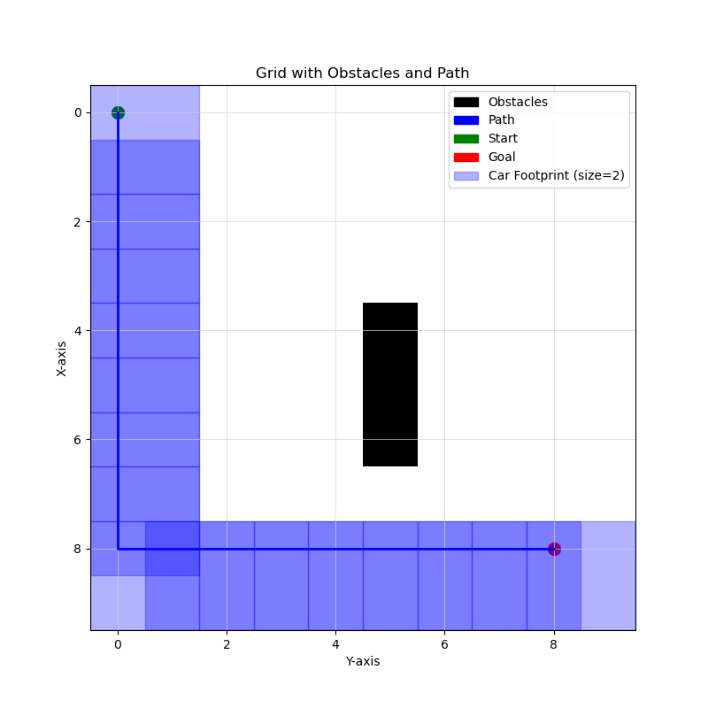

# SelfDrivingCar
GitHub repo for collaboration with Lab 1B CS437

## Test
- Test advanced mapping in your computer with mocks:

`python -m unittest test/test_advanced_mapping.py`

- Test the A* path:

`python -m unittest test/test_path_finder.py`

## Path visual
Following is example of the car finding the path avoiding obstacles:

